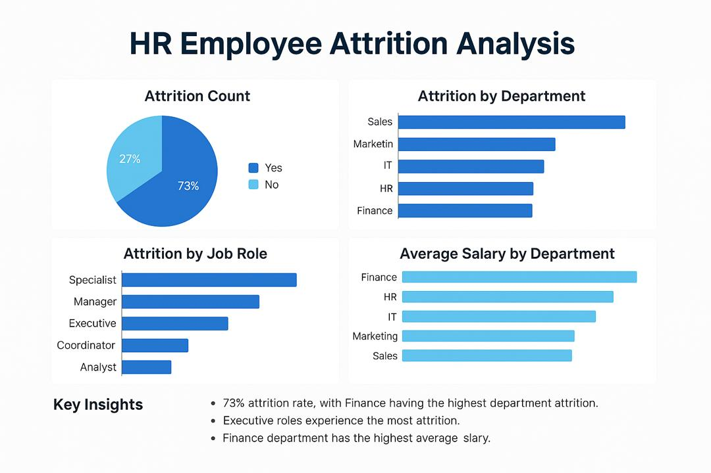

# HR Employee Attrition Analysis – Excel Dashboard (9-Chart Portfolio)

This project explores attrition trends, performance patterns, and salary insights across departments and job roles using Excel Pivot Charts and Data Analysis.

---

## 📊 Visual Insights (Pivot Charts)

1. *Attrition Count (Pie Chart)*  
2. *Attrition by Department*  
3. *Attrition by Job Role*  
4. *Average Salary by Department*  
5. *Employee Count by Department*  
6. *Average Performance Score by Department*  
7. *Performance vs Tenure Group*  
8. *Attrition by Performance Score*  
9. *Attrition by Salary Group*

---

## 🧠 Key Insights

- 73% of employees experienced attrition — most from *Finance* and *Executive roles*
- *High salary earners* showed the highest attrition, challenging assumptions
- *Finance pays the most* but underperforms compared to Marketing & Sales
- *Tenure helps* — performance improves with time at the company
- *Attrition is not limited to low performers*, indicating deeper organizational issues

---

## 🛠 Tools Used

- *Microsoft Excel* (Pivot Tables & Charts)
- *Canva* (Slide Design)
- *GitHub* (Portfolio Publishing)

---

📂 All chart images are available in the /Pivot_Charts/ folder
